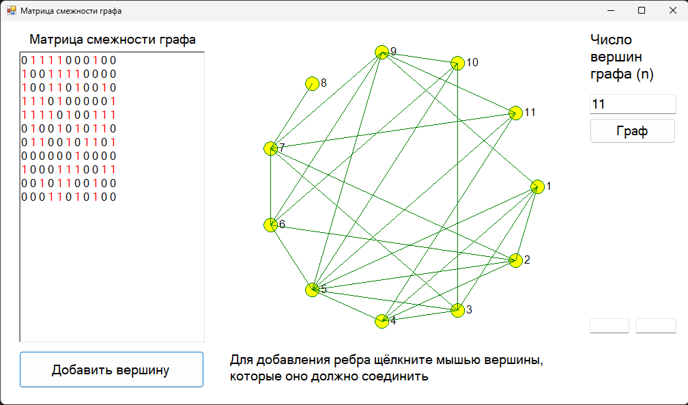

# Программа для генерирования неориентированного графа без петель.

Этот проект представляет собой приложение Windows Forms, написанное на C++/CLI, предназначенное для генерации неориентированных графов без петель. Приложение позволяет пользователям указывать количество вершин, генерировать симметричную матрицу смежности и визуализировать граф на основе этой матрицы.

## Возможности

- **Ввод количества вершин**: Позволяет пользователю указать количество вершин (от 1 до 20).
- **Генерация матрицы смежности**: Генерирует симметричную матрицу смежности для неориентированного графа. Матрица содержит 1 и 0, где `A[i][j] = 1`, если вершины `i` и `j` соединены и `i != j`, в противном случае `A[i][j] = 0`.
- **Визуализация графа**: Рисует граф в соответствии с матрицей смежности. Вершины располагаются на окружности заданного радиуса.
- **Ручное добавление ребер**: Пользователи могут вручную добавлять ребра, щелкая по вершинам на визуализации графа.
- **Чтение файла**: Другой способ создания матрицы смежности — чтение из файла (*.txt, *.csv и т.д.).

## Начало работы

### Необходимые компоненты

- Microsoft Visual Studio с поддержкой C++/CLI.
- .NET Framework.

### Установка

1. Клонируйте репозиторий.
2. Откройте файл решения в Microsoft Visual Studio.

### Запуск приложения

1. Постройте решение в Visual Studio.
2. Запустите приложение.

### Использование

1. **Установить количество вершин**: Введите количество вершин в текстовое поле с меткой "Число вершин графа (n)" и нажмите кнопку "Граф" для генерации графа.
2. **Добавить вершину**: Нажмите кнопку "Добавить вершину", чтобы увеличить количество вершин и обновить граф.
3. **Ручное добавление ребер**: Щелкните по двум вершинам на визуализации графа, чтобы добавить ребро между ними. Матрица смежности будет обновлена соответственно.
4. **Отображение матрицы смежности**: Матрица смежности отображается с выделенными единицами, указывающими на наличие ребер.

### Структура кода

- **Класс MyForm**: Основная форма приложения, содержащая все элементы интерфейса и обработчики событий.
  - **InitializeComponent()**: Инициализирует UI компоненты.
  - **buttonCreate_Click**: Обрабатывает событие нажатия на кнопку "Граф" для генерации графа.
  - **addDot_Click**: Обрабатывает событие нажатия на кнопку "Добавить вершину" для добавления вершины.
  - **GenerateGraph()**: Генерирует матрицу смежности и рисует граф.
  - **DrawGraph()**: Рисует граф на основе матрицы смежности.
  - **graphBox_MouseClick**: Обрабатывает события щелчка мыши на графе для ручного добавления ребер.

### Пример

#### Ввод

- Количество вершин: 7

#### Вывод

- Матрица смежности:
  ```
  0 1 0 0 1 1 1
  1 0 0 0 1 1 0
  0 0 0 1 0 1 0
  0 0 1 0 1 1 1
  1 1 0 1 0 0 0
  1 1 1 1 0 0 0
  1 0 0 1 0 0 0
  ```
- Визуализация графа: Граф с вершинами, расположенными на окружности, соединенными в соответствии с матрицей смежности.

### Скриншоты

#### Пример пользовательского интерфейса



## Технические детали

- **Язык**: C++/CLI
- **Фреймворк**: .NET Framework
- **IDE**: Microsoft Visual Studio

## Лицензия

Этот проект лицензирован по лицензии MIT.
